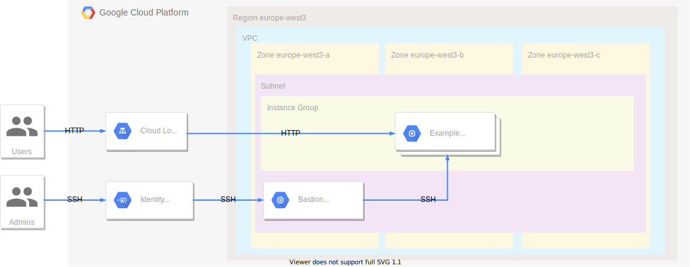

# Terraform GCP Demo
creating infrastructure with terraform in google cloud

## Overview

What we will build:


## Prerequisites

- Terraform installed on machine
- GCP account

## Usage
```bash
tf_state_bucket=$(terraform output -raw bucket)
```

```bash
cd 02-base-project
terraform init \
    -backend-config="bucket=$tf_state_bucket" \
    -backend-config="prefix=state-base-project"
terraform plan
terraform apply
```

```bash
cd 03-example-app
terraform init \
    -backend-config="bucket=$tf_state_bucket" \
    -backend-config="prefix=example-app-project"
terraform plan
terraform apply
```